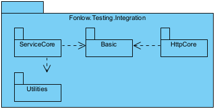

# Fonlow Testing

The goal of this component suite is to help .NET application developers to run integration tests with minimum fixtures in codes and in CI environments being hosted either in local dev machine and the team CI/CD server. You as a software developer will be able to:
1. Run integration tests as early, frequent and quickly as possible on a local dev machine, thus this may minimize the chances of merge conflicts in codes or in the logics of system integration.
2. Most of the fixtures and configuration having been working on a local dev machine should be working in the team CI/CT server, Windows based or Linux based. Therefore, this will reduce the costs of the setup and the maintenance of the CI/CD server.

## NuGet Packages

### For .NET Core 8.0 +

* Package [Fonlow.Testing.Integration](https://www.nuget.org/packages/Fonlow.Testing.Integration)
	* Package [Fonlow.Testing.ServiceCore](https://www.nuget.org/packages/Fonlow.Testing.ServiceCore/) for executing commands and launching services.
		* Class [ServiceCommandsFixture](https://github.com/zijianhuang/FonlowTesting/blob/master/Fonlow.Testing.ServiceCore/ServiceCommandsFixture.cs)
	* Package [Fonlow.Testing.HttpCore](https://www.nuget.org/packages/Fonlow.Testing.HttpCore/) for making HTTP client requests including OAuth2 username/password requests.
		* Class [BasicHttpClient](https://github.com/zijianhuang/FonlowTesting/blob/master/Fonlow.Testing.HttpCore/BasicHttpClient.cs)
		* Class [HttpClientWithUsername](https://github.com/zijianhuang/FonlowTesting/blob/master/Fonlow.Testing.HttpCore/HttpClientWithUsername.cs)
	* Package [Fonlow.Testing.Utilities](https://www.nuget.org/packages/Fonlow.Testing.Utilities)
		* Class [DeploymentItemFixture](https://github.com/zijianhuang/FonlowTesting/blob/master/Fonlow.Testing.Utilities/DeploymentItemFixture.cs)

You may install the whole "Integration" package, or "ServiceCore", "HttpCore" or "Utilities" respectively depending on your use cases. 



**Remarks:**
* Some classes in some packages are marked with "ObsoleteAttribute", because many of them had been developed during the .NET Framework era. Though they should be working well in Windows machines, however, often the CI/CD environments these days are running on Linux, thus respective integration test cases may not be able to run in such environments.

## Examples

The examples are with xUnit.NET, and you should be able to use the component suite in NUnit.

### Dependencies MySql database and ASP.NET Core Web API

appsettings.json of the integration test suite:
```json
{
	"Testing": {
		"ServiceCommands": [
			{
				"CommandPath": "../../../../../PoemsMyDbCreator/bin/{BuildConfiguration}/net8.0/PoemsMyDbCreator.exe",
				"Arguments": "Fonlow.EntityFrameworkCore.MySql \"server=localhost;port=3306;Uid=root; password=zzzzzzzz; database=Poems_Test; Persist Security Info=True;Allow User Variables=true\"",
				"Delay": 0
			},

			{
				"CommandPath": "dotnet",
				"Arguments": "run --project ../../../../../PoetryApp/PoetryApp.csproj --no-build --configuration {BuildConfiguration}",
				"BaseUrl": "http://localhost:5300/",
				"Delay": 1
			}
		],

		"Username": "admin",
		"Password": "MyPassword123"
...
...
	}
}
```

The settings will instruct the collection fixture as shown below to:
1. Use PoemsMyDbCreator.exe that will tear-down the DB and create a new one;
2. Launch Web API PoetryApp that uses the blank new DB.

These 2 steps are executed synchronously. However, the launched Web API may not be able to listen immediately, therefore, it may be good to add a "Delay" 1 to 5 seconds. Typically in GitHub Actions/Workflow, 5-second is a safe bet.

And the Username and password pair will be used by `class AuthHttpClientWithUsername : HttpClientWithUsername` and `class PoemsFixture : AuthHttpClientWithUsername` together to connect the the Web API and obtain the JWT once.

Collection Fixture and Class Fixture:
```c#
namespace PoemsIntegrationTests
{
	public class TestConstants
	{
		public const string LaunchWebApiAndInit = "LaunchWebApi";
	}

	[CollectionDefinition(TestConstants.LaunchWebApiAndInit)]
	public class DotNetHostCollection : ICollectionFixture<Fonlow.Testing.ServiceCommandsFixture>
	{
	}

	public class AuthHttpClientWithUsername : HttpClientWithUsername
	{
		public AuthHttpClientWithUsername() : this(null)
		{
		}

		public AuthHttpClientWithUsername(HttpMessageHandler handler) : base(new Uri(TestingSettings.Instance.ServiceCommands[1].BaseUrl), TestingSettings.Instance.Username, TestingSettings.Instance.Password, handler)
		{
		}
	}

	public class PoemsFixture : AuthHttpClientWithUsername
	{
		public PoemsFixture()
		{
			System.Text.Json.JsonSerializerOptions jsonSerializerSettings = new System.Text.Json.JsonSerializerOptions()
			{
				DefaultIgnoreCondition = System.Text.Json.Serialization.JsonIgnoreCondition.WhenWritingNull,
				PropertyNameCaseInsensitive = true,
			};

			Api = new PoemsApp.Controllers.Client.Poems(AuthorizedClient, jsonSerializerSettings);
			TagsApi = new PoemsApp.Controllers.Client.Tags(AuthorizedClient, jsonSerializerSettings);
		}

		public PoemsApp.Controllers.Client.Poems Api { get; private set; }
		public PoemsApp.Controllers.Client.Tags TagsApi { get; private set; }
	}

	[Collection(TestConstants.LaunchWebApiAndInit)]
	public class PoemsTests : IClassFixture<PoemsFixture>
	{
		public PoemsTests(PoemsFixture fixture)
		{
			api = fixture.Api;
			tagsApi = fixture.TagsApi;
			authorizedClient = fixture.AuthorizedClient;
		}

		readonly PoemsApp.Controllers.Client.Poems api;
		readonly PoemsApp.Controllers.Client.Tags tagsApi;
		readonly HttpClient authorizedClient;

		[Fact]
		public async Task TestAddPoemAndUpdatePublished()
		{
...
...
```


**Remarks**

* You may have an integration test suite that test the Data Access Layer based on Entity Framework (Core) or the Business Logic Layer using something similar to "PoemsMyDbCreator".

### Dependencies on Sqlite database as file assets and 2 ASP.NET Core Web API services

The first Web API is for OAuth2 authentication, and the Pet Store Web API recognizes the JWT issued by the first one. Please check [Pet Store Api Tests](https://github.com/zijianhuang/AuthEF/tree/master/Tests/PetStoreApiTests).

```json
{
	"Testing": {
		"CopyItems": [
			{
				"Source": "../../../../../Core3WebApi/DemoApp_Data",
				"Destination": "../../../../../Core3WebApi/bin/{BuildConfiguration}/net8.0/DemoApp_Data"
			}
		],
		"ServiceCommands": [
			{
				"CommandPath": "../../../../../Core3WebApi/bin/{BuildConfiguration}/net8.0/Core3WebApi{ExecutableExt}",
				"BaseUrl": "http://127.0.0.1:5000/",
				"Delay": 1,
				"Users": [
					{
						"Username": "admin",
						"Password": "Pppppp*8"
					}
				]
			},

			{
				"CommandPath": "../../../../../PetWebApi/bin/{BuildConfiguration}/net8.0/PetWebApi{ExecutableExt}",
				"BaseUrl": "http://127.0.0.1:6000/",
				"Delay": 5,
				"Users": [
					{
						"Username": "admin",
						"Password": "Pppppp*8"
					}
				]
			}
		]
	},

}
```

### Dependencies Some Files

```json
	"Testing": {
		"ServiceCommands": [
			{
				"CommandPath": "Copy-Item ../../../PowerShellTests.cs ./D_PowerShellTests.cs",
				"IsPowerShellCommand": true
			},
```

`ServiceCommandsFixture` will run PowerShell Command Copy-Item in the same process of the test suite via Microsoft.PowerShell.SDK. However, keep in mind "Copy-Item" is still asynchronous, even though the fixture runs the whole "ServiceCommand" synchronously. If some test cases depends on the file assets, they could fail, sometimes randomly.

To ensure copying files synchronously, use the following setup:

```json
	"Testing": {
		"CopyItems": [
			{
				"Source": "../../../Assets",
				"Destination":  "./Assets"
			}
		]
```

Most PowerShell commands are synchronous, and "Copy-Item" are among few that are asynchronous. 

**Remarks:**
1. Developers on MS stacks have been using pre-build event and post-build event of MsBuild to setup and tear down artifacts and assets needed. However, in Linux environment, things have become a bit complicated. For examples, "cp" of Linux is by default asynchronous, and "Copy-Item" of PowerShell is asynchronous. Therefore, it could happen that some test cases run before the artifacts/assets are copied over, resulting in failed cases, sometimes randomly.

## Ideas behind this Component Suite

For the sake of CI, TDD, BDD, unit testing and integration testing, is it a CI server mandatory like TFS, TeamCity, Bamboo or Azure DevOps etc.? 

Sometimes it could be handy and costing less to setup CI environment as much as possible in each dev machine. Developers endorsing XP or TDD have been doing so for years before those off-the-shelf CI/CD products were released to the market for team CI/CD.

Your .NET projects have enough dependencies on .NET and Visual Studio already, why not utilize the maximum from such dependencies before depending on another vendor specific out-of-the-shelf CI/CD server?

If you could ensure local integration tests as much as possible first, your scripts of the CI/CD server could be minimum, with benefits:
1. Less configuration/settings on the CI/CD server means lower setup and maintenance costs.
1. You test almost everything in your dev PC, minimizing the needs to setting up dependencies explicitly on the CI/CD server. More integration tests could be carried out along your coding on your dev PC.

A typical integration [test suite](https://en.wikipedia.org/wiki/Test_suite) should have the dependencies ready automatically before running. While a CI server generally has some built-in mechanism to launch respective dependencies and then run those test suites, it will be nicer that the integration test suite can take care of the dependencies at some degree, especially for those in-house service applications. And the locked-in effect on a particular brand of team CI/CD product could be the least.

**Remarks:**
* A dedicated CI server generally provides comprehensive and powerful mechanisms of setting up and tearing down dependencies, like GitHub Actions/Workflows. This library will remain light-weight and serve as a complementary tool for overall CI/CD.

## Built-in Variables
This component suite provides a few built-in variable:
1. `{BuildConfiguration}`. `ServiceCommandsFixture` will substitute the variable to `Release` for Release build of the test suite, and `Debug` for the Debug build. Utilizing this may help you to minimize the need to have additional "appsettings.Debug.json" and alike. 
2. `{ExecutableExt}`. An application compiled in Windows will by default have "EXE" as file extension name, while on Linux and MacOS, such extension is empty.

**Remarks:**
* While you can use `dotnet run MyWebApi.dll",  however, it is difficult to adjust the current directory and the Web root directory, which some extra dependencies of the Web API may need to be aware. Therefore, running "MyWebApi{ExecutableExt}" is a safe bet if such extra dependencies are needed.

## More Examples

Alternative, you may have "appsettings.Debug.json", "appsettings.Release.json" or even something like "appsettings.MacRelease.json" together with "appsettings.json".

appsettings.Debug.json:
```json
{
	"Testing": {
		"ServiceCommands": [
			{
				"CommandPath": "dotnet",
				"Arguments": "run --project ../../../../../DemoCoreWeb/DemoCoreWeb.csproj --no-build --configuration Debug",
				"BaseUrl": "http://127.0.0.1:5000/",
				"Delay": 2
			}
		]
	}
}
```


## Settings

```csharp
public sealed class TestingSettings
{
	public ServiceCommand[] ServiceCommands { get; set; }

	public CopyItem[] CopyItems { get; set; }

	/// <summary>
	/// Used when Web resource is there, no need to be under the control of the test suite.
	/// </summary>
	public string BaseUrl { get; set; }

	public string Username { get; set; }
	public string Password { get; set; }

	/// <summary>
	/// For testing with many different user credentials.
	/// </summary>
	public UsernamePassword[] Users { get; set; }
}

public sealed class UsernamePassword
{
	public string Username { get; set; }
	public string Password { get; set; }
}

public sealed class ServiceCommand
{
	public string CommandPath { get; set; }

	public bool IsPowerShellCommand { get; set; }

	public string Arguments { get; set; }

	/// <summary>
	/// Some services may take some seconds to launch then listen, especially in GitHub Actions which VM/container could be slow. A good bet may be 5 seconds.
	/// </summary>
	public int Delay { get; set; }
	public string ConnectionString { get; set; }
	public string BaseUrl { get; set; }
}
```


[Examples of Integration Test Suite](https://github.com/zijianhuang/DemoCoreWeb/tree/master/Tests/ServiceCommandIntegrationTests)

### More Examples of Launching Services/Commands

### In-house Web API

```json
{
	"CommandPath": "dotnet",
	"Arguments": "run --project ../../../../../DemoCoreWeb/DemoCoreWeb.csproj --no-build --configuration {BuildConfiguration}",
}
```
Hints:

* The current directory of the launched Web API is the directory containing the csproj file.

```json
{
	"CommandPath": "dotnet",
	"Arguments": "../../../../../DemoCoreWeb/bin/{BuildConfiguration}/net8.0/DemoCoreWeb.dll",
}
```

Hints:

* The current directory of the launched Web API is the directory of the test suite. Thus if some features of Web API depends on the locations of current directory, content root path and Web root path, such launch may result in problems, for example, it cannot find some files in some default relative locations.

```json
{
	"CommandPath": "../../../../../DemoCoreWeb/bin/{BuildConfiguration}/net8.0/DemoCoreWeb{ExecutableExt}",
}
```

Hints:

* The current directory of the launched Web API is the directory of the EXE file. And this is recommended. On MacOs and Linux, the extension name of executable files is empty, while on Windows, it is ".exe".
* The only setback comparing with launching through the csproj file is that after upgrading to next .NET version, you need to adjust the .NET version in the path, for example, from "net8.0" to "net9.0" and so on.

## GitHub Workflow

For .NET developers, GitHub actions provides a "dotnet.yml" which by default run the debug build. Sometimes it may be more appropriate to run release build. Therefore, change the last 2 steps, like:
```yml
	- name: Build
	  run: dotnet build --no-restore --configuration Release
	- name: Test
	  run: dotnet test --no-build --verbosity normal --configuration Release
```
And name the file as "dotnetRelease.yml".

If the integration test suites depend on relatively simple "out-of-process" resources such as ASP.NET Core Web services, the helper classes of "Fonlow.Testing.ServiceCore" could be simple and handy enough before you need to craft more complex GitHub workflows.

Examples:

* https://github.com/zijianhuang/webapiclientgen/actions
* https://github.com/zijianhuang/openapiclientgen/actions

# Alternatives

The libraries of helper classes have been developed since the .NET Framework era. These days since .NET Core, there have been more well designed libraries around:

* [Functional Testing ASP.NET Core Apps](https://learn.microsoft.com/en-us/dotnet/architecture/modern-web-apps-azure/test-asp-net-core-mvc-apps#functional-testing-aspnet-core-apps)
* [Docker Compose Fixture](https://github.com/devjoes/DockerComposeFixture)
* [Integration Test with .Net Core and Docker](https://ademcatamak.medium.com/integration-test-with-net-core-and-docker-21b241f7372)
* [BenchmarkDotNet](https://github.com/dotnet/BenchmarkDotNet)

**References:**

* [Different Types of Tests](https://www.atlassian.com/continuous-delivery/software-testing/types-of-software-testing)

